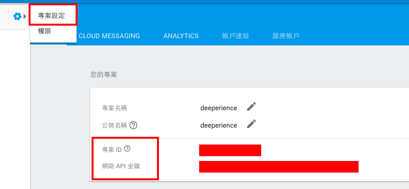

# Firebase

## 前言

在這章之前，我們提到的有關技術，全部都是在 native 端，這章開始之後，我們會開始談一些後端串接的部分。而有關後端教學的第一章，就是我們的重點 —— [Firebase](https://firebase.google.com/?hl=zh-TW)。

## Firebase 是什麼？

Firebase 是 Google 提供的 BAAS (backend as a service) 服務。所謂的 BAAS ，有別於傳統一後端一個 API server，負責連結前端和資料庫，這類型的服務直接將兩者整合在一起，減去架設 API server 的麻煩。因此非常適合簡單的手機程式和網頁程式使用。

此外，Firebase 還有一個很大的優勢，就是已經整合了麻煩的註冊和登入驗證功能，簡單的設定完之後，就可以快速的進入開發。更厲害的是，連簡單的 mail server 包含驗證性和忘記密碼功能也都有提供，十分適合手機 prototype 的建立。

另外，Firebase 也有提供 storage 的服務，只是這個功能我們的 boilerplate 還沒串接好，就留到之後的版本出吧。

## Firebase 的連接方式

Firebase 的連接方式很簡單，只要用一般的 fetch 方法，搭配 request method 和 data，就可以完成一次 request。

```
  fetch(domain, {
    method: 'post',
    headers: {
      Accept: 'application/json',
      'Content-Type': 'application/json',
    },
    body: JSON.stringify(body),
  }).then(res => res.json())
```
回傳回來的是一個 promise ，所以我們可以串接很多個 then，依續做我們想做的事。而程式碼中的 method，可以請讀者一個一個試試看，包括GET, POST, PUT, DELETE。

## 設定 Firebase

1. 先到 [連結](https://console.firebase.google.com/?hl=zh-TW) 開一個新的專案。
2. 接著到```src/config-template.js```，複製出一個 ```config.js```，更改下面這個部分。這麼做是因為 config.js 已經加到 ```.gitignore``` 了，所以不會被push到開放空間。



其中 XXX 是專案ID，然後 apiKey 就是 APIKey。

```
apiKey: 'apiKey',
authDomain: 'XXX.firebaseapp.com',
databaseURL: 'https://XXX.firebaseio.com',
storageBucket: 'XXX.appspot.com',
```
3. 如果想要開通 社群登入或信箱驗證的功能，也可以到網站的 ```Authentication > 登入方式``` 去做開通。

## 結語
到這裡，基本的 firebase 設定就完成了，更深入更實戰的部分，就交給各位在我們的 boilerplate 裡面探索囉！

## 延伸閱讀

1. [Getting started with React Native and Firebase](https://medium.com/@jamesmarino/getting-started-with-react-native-and-firebase-ab1f396db549#.ky3d9gxk1)