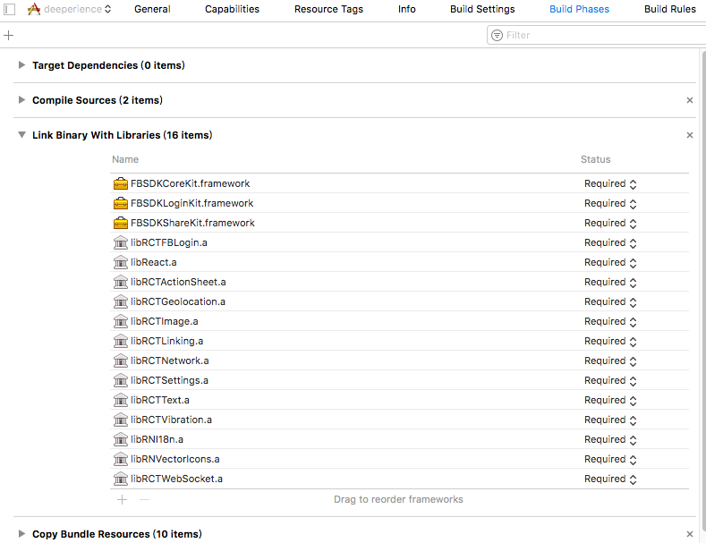

# iOS Structure

##前言

關於 JS 在 ```react-native``` 中的部分，算是都講解完了，接下來這三章，會提到 react native 和 android 及 ios 接口的部分。因為在 debug 的時候，常常會需要在 android 和 ios 之間做設定，或者有時候又要根據 ios ，寫一個 library ，那麼了解各自的結構，就會是一件很重要的事。

## iOS 架構

iOS 的大致架構如以下這個樣子

```
/ios
	/build
	/deeperience
	/deeperience-xcodeproj
	/deeperience.xcworkspace
	/deeperienceTests
	/Framework
```
首先第一個資料夾 ```/ios/build``` 放的是整個程式碼在 ```react-native run-ios``` build 出來的檔案。因此，出現問題的時候，可以把它刪掉，再 rebuild 一次，或者直接 rebuild 蓋過去。

```/ios/deeperience``` 放的是主要程式碼，裡面有整個 ios 程式的 entry point。而```deeperience-xcodeproj``` 則是 xcode 開檔的依據，要在 xcode 讀取和設定專案，就要開這個檔案。

```Framework``` 則是放一些外部的程式庫，例如在我們的專案裡面，就有用到 FB 登入的函式庫。Xcode 打開就會看到 FB登入的 framework。 


## Xcode 下的 iOS

通常只有在設定 library path 的時候，我們才會開 xcode。

點擊左邊的 project，然後點擊上方的 build settings，往下拉一下，或者搜尋一下，就可以看到這兩張圖。分別是設定 framework path 和 header path 的地方。所謂的 framework path上面已經有解釋過了，這邊解釋一下什麼是 header。所謂的 header 就是 react native node module 裡面有使用原生 iOS code，也就是有寫 swift code 或者 object code 的 header file 的所在地。我們會在這裡設定他的path，確保 iOS 可以確實引用到這些 library。而圖中的 ```$(SRCROOT)``` 就是 ```/ios``` 這個資料夾，並非原來的 react native 資料夾。


然後點擊 Build phases 的時候，也會發現類似下圖的圖案。這個是因為編譯器在編譯程式碼的時候，必須去 link library，在這邊我們做這個設定。



## 結語

通常，這些library path 的設定都不用由我們親自效勞，下個 ```react-native link```就可以解決了。因此這章所帶到的東西，在實務上比較不常用。然而，常常發生一些特別錯誤時，到頭來都會發現是這邊沒有設定好，筆者我也踩了不少雷。