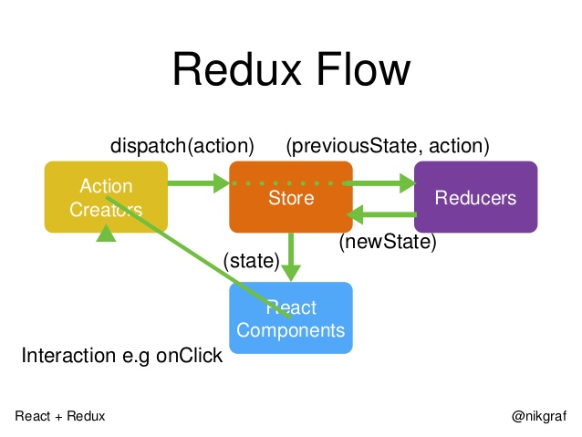
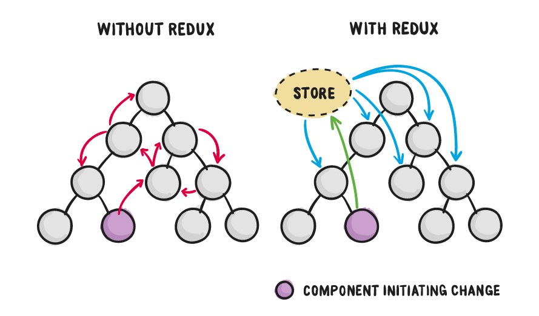

# Redux & React

##  前言

```Redux``` 是一個基於 flux 的設計原理而設計的 library，跟 React 是兩個不一樣的library。然而在 React 的單向資料流下，Redux 簡單的特性可以和 React 結合的非常的好，構成一個很好維護的專案。在我們的 boilerplate 裡面，也是大量使用到 Redux 的精神來做設計。 

本文希望帶讀者入門快速了解 redux，並了解 redux 的精神，目的並非要讓讀者完全熟練，若想要精進的讀者，可以參考網路資料或者延伸閱讀。

## Flux

首先第一個要建立的觀念是，flux是一個設計原理，而 Redux 是實現他的 library。在 flux 的概念下，我們可以把一個UI 事件的發生，從開始到結束分成以下好幾個階段。


[圖片來源](https://facebook.github.io/flux/docs/overview.html)

以上的過程中，當我們要更改 UI 時，我們需要透過 dispatcher 發一個 ```action``` 。當 ```store``` 接到 action 的時候，會更新 store 裡面的資料，而我們的 UI component 只要訂閱這個 store 即可。

## Redux

Redux 基於這樣的精神，發展出了另一套類似的 library。Redux 的資料流如下：



[圖片來源](http://www.slideshare.net/nikgraf/react-redux-introduction)

同理，當我們需要更新UI的時候，我們就透過 dispatcher 去發出一個 action。如果客倌們有仔細看圖的話，有一個叫 Action creator 的東西，他就是負責產生我們的 action 的 function，因此我們對於這兩個程式的call法，大致會是長這個樣子。

```
const dispatchAction = () => dispatch(actionCreator(payload))

const actionCreator = (payload) => ({
	type: 'UPDATE_TODO_LIST',
	payload,
})
```

action creator 回傳的 action是一個物件，其中會有一個 type 是辨別什麼 UI 的變更，payload 則承載著資料。

接著，當全域的 store 收到這個 action 後，依照不同的 type ，更新不同部分的資料。大致上程式碼如下。

```
const reducer = (state, action) => {
	switch(action.type) {
		case 'UPDATE_TODO_LIST':
			return {
				...state,
				todolist: action.payload,
			}
		case 'DELETE_TODO_LIST':
			// ...
	}
}
```
仔細看一下程式碼，```state```的部分就是 ```store```，儲存著 UI component 要用的資料。reducer 會把舊的 state 拿進來，然後傳回新的 state。

最後，UI component 只要訂閱全域的 store，當 store 更新的時候，就重新 render 一次。

## Redux &  React 為什麼這麼配？

Redux 和 React 搭配的原因，可以分成底下兩個：

- React 的單項資料流，和 redux 的 store 不謀而合。只要我們在源頭的 component 訂閱 store，資料接著使用 props 傳下去即可。而且，因為是 Single source of truth，資料和 component 的狀態相當好維護。這幾句話可以用下面這張圖，傳神的表達：



[圖片來源](https://css-tricks.com/learning-react-redux/)

- 有些 dom 訂閱 global 的 store，有些 dom 訂閱父元件的 props（精確來說，應該是 virtual DOM），DOM 的結構容易維護，也容易重複使用。

- 當管 controller 的 action creator 和 reducer，以及掌管 view 的 DOM 分離，更好維護，也更有彈性。 

- 因為 reducer 和 action creator 的功能非常明確，所以我們能清鬆的架構出有條理的結構，關於這部分，我們會在之後的章節繼續介紹。

# 延伸閱讀

1. [Overview of Flux](https://facebook.github.io/flux/docs/overview.html)
2. [React ＋ Redux Introduction](http://www.slideshare.net/nikgraf/react-redux-introduction)
3. [Redux 簡介](http://huli.logdown.com/posts/294037-javascript-redux-basic-tutorial)
4. [Leveling Up with React: Redux](https://css-tricks.com/learning-react-redux/)
5. [Redux](http://redux.js.org/)